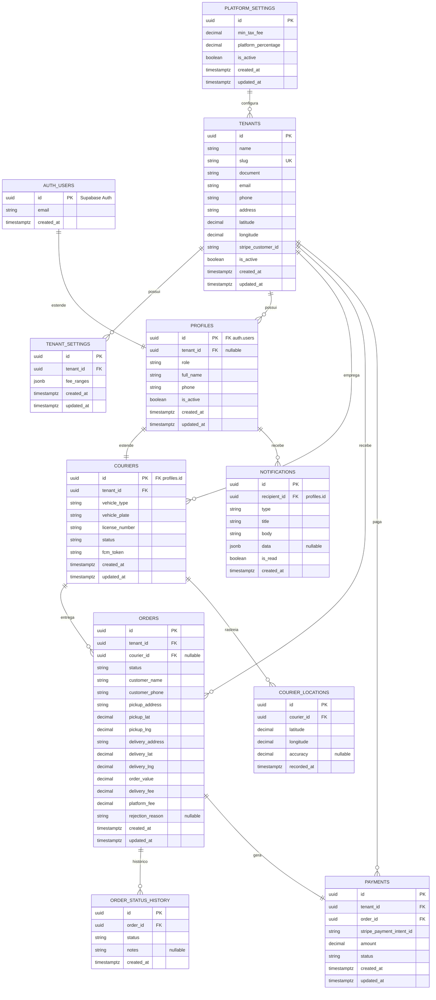

# 🗺️ SCHEMA.md — GoDelivery

> **Fonte de Verdade:** Design-first. Nenhuma migration é criada antes deste documento estar 100% aprovado.
> **Status:** 🟡 Em design — aguardando aprovação final antes de migrations.

---

## 📊 Status do Banco de Dados

| Campo                  | Valor                          |
| ---------------------- | ------------------------------ |
| **Estado Atual**       | 🟡 Em design                   |
| **Projeto**            | GoDelivery                     |
| **Última Atualização** | 2026-06-22                     |
| **Migration Base**     | `20260509000001_initial_setup` |

---

## 🧩 Diagrama de Relacionamentos



---

## 🛠️ Extensões Instaladas

| Extensão      | Schema       | Descrição                                         |
| ------------- | ------------ | ------------------------------------------------- |
| **uuid-ossp** | `extensions` | UUIDs v4 para PKs                                 |
| **pg_net**    | `extensions` | HTTP assíncrono (webhooks, notificações)          |
| **postgis**   | `extensions` | Geoespacial (opcional, para queries de distância) |

---

## 📋 Enums

### `user_role`

```sql
CREATE TYPE user_role AS ENUM ('admin', 'business_owner', 'courier');
```

### `order_status`

```sql
CREATE TYPE order_status AS ENUM (
  'draft',           -- Taxa calculada, ainda não enviada
  'pending_courier', -- Enviada ao motoboy, aguardando aceite
  'accepted',        -- Motoboy aceitou
  'collected',       -- Empresário confirmou coleta
  'in_transit',      -- Em rota de entrega
  'delivered',       -- Entregue
  'rejected'         -- Motoboy recusou
);
```

### `courier_status`

```sql
CREATE TYPE courier_status AS ENUM ('offline', 'available', 'busy');
```

### `payment_status`

```sql
CREATE TYPE payment_status AS ENUM ('pending', 'paid', 'failed');
```

---

## 📋 Tabelas

### `platform_settings`

Configurações globais da plataforma (definidas pelo admin).

| Coluna                | Tipo          | Constraints                    | Descrição                         |
| --------------------- | ------------- | ------------------------------ | --------------------------------- |
| `id`                  | UUID          | PK, DEFAULT uuid_generate_v4() | Identificador                     |
| `min_tax_fee`         | DECIMAL(10,2) | NOT NULL, DEFAULT 5.00         | Taxa mínima de entrega (R$)       |
| `platform_percentage` | DECIMAL(5,2)  | NOT NULL, DEFAULT 20.00        | % da taxa cobrada pela plataforma |
| `is_active`           | BOOLEAN       | NOT NULL, DEFAULT true         | Config ativa                      |
| `created_at`          | TIMESTAMPTZ   | NOT NULL, DEFAULT now()        |                                   |
| `updated_at`          | TIMESTAMPTZ   | NOT NULL, DEFAULT now()        |                                   |

**RLS:**

```sql
-- Admin lê tudo; ninguém mais acessa diretamente
CREATE POLICY "Admin read platform settings"
ON platform_settings FOR SELECT
USING (EXISTS (
  SELECT 1 FROM profiles
  WHERE profiles.id = auth.uid()
  AND profiles.role = 'admin'
));
```

---

### `tenants`

Empresas cadastradas na plataforma.

| Coluna               | Tipo          | Constraints                    | Descrição                   |
| -------------------- | ------------- | ------------------------------ | --------------------------- |
| `id`                 | UUID          | PK, DEFAULT uuid_generate_v4() |                             |
| `name`               | TEXT          | NOT NULL                       | Nome do estabelecimento     |
| `slug`               | TEXT          | NOT NULL, UNIQUE               | Identificador URL-friendly  |
| `document`           | TEXT          |                                | CNPJ/CPF                    |
| `email`              | TEXT          | NOT NULL                       | Email do responsável        |
| `phone`              | TEXT          |                                | Telefone de contato         |
| `address`            | TEXT          |                                | Endereço do estabelecimento |
| `latitude`           | DECIMAL(10,8) |                                | Lat do estabelecimento      |
| `longitude`          | DECIMAL(11,8) |                                | Lng do estabelecimento      |
| `stripe_customer_id` | TEXT          |                                | ID do cliente Stripe        |
| `is_active`          | BOOLEAN       | NOT NULL, DEFAULT true         |                             |
| `created_at`         | TIMESTAMPTZ   | NOT NULL, DEFAULT now()        |                             |
| `updated_at`         | TIMESTAMPTZ   | NOT NULL, DEFAULT now()        |                             |

**RLS:**

```sql
-- Admin vê tudo
CREATE POLICY "Admin read all tenants"
ON tenants FOR SELECT
USING (EXISTS (
  SELECT 1 FROM profiles WHERE id = auth.uid() AND role = 'admin'
));

-- Empresário vê só o próprio tenant
CREATE POLICY "Business owner read own tenant"
ON tenants FOR SELECT
USING (EXISTS (
  SELECT 1 FROM profiles WHERE id = auth.uid() AND tenant_id = tenants.id
));
```

---

### `tenant_settings`

Configurações de taxa de entrega por tenant.

| Coluna       | Tipo        | Constraints                                   | Descrição                           |
| ------------ | ----------- | --------------------------------------------- | ----------------------------------- |
| `id`         | UUID        | PK, DEFAULT uuid_generate_v4()                |                                     |
| `tenant_id`  | UUID        | NOT NULL, FK → tenants(id), ON DELETE CASCADE |                                     |
| `fee_ranges` | JSONB       | NOT NULL, DEFAULT '[]'                        | Array de faixas {minKm, maxKm, fee} |
| `created_at` | TIMESTAMPTZ | NOT NULL, DEFAULT now()                       |                                     |
| `updated_at` | TIMESTAMPTZ | NOT NULL, DEFAULT now()                       |                                     |

**RLS:**

```sql
CREATE POLICY "Tenant isolation"
ON tenant_settings FOR ALL
USING (tenant_id = (SELECT tenant_id FROM profiles WHERE id = auth.uid()));
```

---

### `profiles`

Perfil de usuários (estende auth.users).

| Coluna       | Tipo        | Constraints                                | Descrição       |
| ------------ | ----------- | ------------------------------------------ | --------------- |
| `id`         | UUID        | PK, FK → auth.users(id), ON DELETE CASCADE |                 |
| `tenant_id`  | UUID        | FK → tenants(id), ON DELETE SET NULL       | NULL para admin |
| `role`       | user_role   | NOT NULL, DEFAULT 'business_owner'         |                 |
| `full_name`  | TEXT        |                                            | Nome completo   |
| `phone`      | TEXT        |                                            | Telefone        |
| `is_active`  | BOOLEAN     | NOT NULL, DEFAULT true                     |                 |
| `created_at` | TIMESTAMPTZ | NOT NULL, DEFAULT now()                    |                 |
| `updated_at` | TIMESTAMPTZ | NOT NULL, DEFAULT now()                    |                 |

**RLS:**

```sql
-- Admin vê tudo
CREATE POLICY "Admin read all profiles"
ON profiles FOR SELECT
USING (EXISTS (
  SELECT 1 FROM profiles self WHERE self.id = auth.uid() AND self.role = 'admin'
));

-- Empresário vê só perfis do próprio tenant
CREATE POLICY "Business owner read tenant profiles"
ON profiles FOR SELECT
USING (
  tenant_id = (SELECT tenant_id FROM profiles WHERE id = auth.uid())
);

-- Motoboy vê só o próprio perfil
CREATE POLICY "Courier read own profile"
ON profiles FOR SELECT
USING (id = auth.uid());

-- Cada um atualiza só o próprio perfil
CREATE POLICY "Users update own profile"
ON profiles FOR UPDATE
USING (id = auth.uid())
WITH CHECK (id = auth.uid());
```

---

### `couriers`

Dados específicos do motoboy.

| Coluna           | Tipo           | Constraints                                   | Descrição           |
| ---------------- | -------------- | --------------------------------------------- | ------------------- |
| `id`             | UUID           | PK, FK → profiles(id), ON DELETE CASCADE      |                     |
| `tenant_id`      | UUID           | NOT NULL, FK → tenants(id), ON DELETE CASCADE |                     |
| `vehicle_type`   | TEXT           |                                               | Tipo de veículo     |
| `vehicle_plate`  | TEXT           |                                               | Placa               |
| `license_number` | TEXT           |                                               | Número da CNH       |
| `status`         | courier_status | NOT NULL, DEFAULT 'offline'                   |                     |
| `fcm_token`      | TEXT           |                                               | Token FCM para push |
| `created_at`     | TIMESTAMPTZ    | NOT NULL, DEFAULT now()                       |                     |
| `updated_at`     | TIMESTAMPTZ    | NOT NULL, DEFAULT now()                       |                     |

**RLS:**

```sql
-- Empresário vê couriers do próprio tenant
CREATE POLICY "Business owner read tenant couriers"
ON couriers FOR SELECT
USING (tenant_id = (SELECT tenant_id FROM profiles WHERE id = auth.uid()));

-- Motoboy vê só o próprio registro
CREATE POLICY "Courier read own record"
ON couriers FOR SELECT
USING (id = auth.uid());

-- Motoboy atualiza próprio status e fcm_token
CREATE POLICY "Courier update own record"
ON couriers FOR UPDATE
USING (id = auth.uid())
WITH CHECK (id = auth.uid());
```

---

### `orders`

Pedidos de entrega.

| Coluna             | Tipo          | Constraints                                   | Descrição             |
| ------------------ | ------------- | --------------------------------------------- | --------------------- |
| `id`               | UUID          | PK, DEFAULT uuid_generate_v4()                |                       |
| `tenant_id`        | UUID          | NOT NULL, FK → tenants(id), ON DELETE CASCADE |                       |
| `courier_id`       | UUID          | FK → couriers(id), ON DELETE SET NULL         |                       |
| `status`           | order_status  | NOT NULL, DEFAULT 'draft'                     |                       |
| `customer_name`    | TEXT          | NOT NULL                                      | Nome do cliente final |
| `customer_phone`   | TEXT          | NOT NULL                                      | Telefone do cliente   |
| `pickup_address`   | TEXT          | NOT NULL                                      | Endereço de coleta    |
| `pickup_lat`       | DECIMAL(10,8) |                                               |                       |
| `pickup_lng`       | DECIMAL(11,8) |                                               |                       |
| `delivery_address` | TEXT          | NOT NULL                                      | Endereço de entrega   |
| `delivery_lat`     | DECIMAL(10,8) |                                               |                       |
| `delivery_lng`     | DECIMAL(11,8) |                                               |                       |
| `order_value`      | DECIMAL(10,2) | NOT NULL, DEFAULT 0                           | Valor do pedido       |
| `delivery_fee`     | DECIMAL(10,2) | NOT NULL, DEFAULT 0                           | Taxa de entrega       |
| `platform_fee`     | DECIMAL(10,2) | NOT NULL, DEFAULT 0                           | Taxa da plataforma    |
| `rejection_reason` | TEXT          |                                               | Motivo da recusa      |
| `created_at`       | TIMESTAMPTZ   | NOT NULL, DEFAULT now()                       |                       |
| `updated_at`       | TIMESTAMPTZ   | NOT NULL, DEFAULT now()                       |                       |

**RLS:**

```sql
-- Empresário vê pedidos do próprio tenant
CREATE POLICY "Business owner read tenant orders"
ON orders FOR SELECT
USING (tenant_id = (SELECT tenant_id FROM profiles WHERE id = auth.uid()));

-- Empresário cria pedidos no próprio tenant
CREATE POLICY "Business owner insert tenant orders"
ON orders FOR INSERT
WITH CHECK (tenant_id = (SELECT tenant_id FROM profiles WHERE id = auth.uid()));

-- Motoboy vê pedidos atribuídos a ele
CREATE POLICY "Courier read assigned orders"
ON orders FOR SELECT
USING (courier_id = auth.uid());

-- Motoboy atualiza status de pedidos atribuídos
CREATE POLICY "Courier update assigned orders"
ON orders FOR UPDATE
USING (courier_id = auth.uid())
WITH CHECK (courier_id = auth.uid());
```

---

### `order_status_history`

Audit trail imutável de mudanças de status.

| Coluna       | Tipo         | Constraints                                  | Descrição         |
| ------------ | ------------ | -------------------------------------------- | ----------------- |
| `id`         | UUID         | PK, DEFAULT uuid_generate_v4()               |                   |
| `order_id`   | UUID         | NOT NULL, FK → orders(id), ON DELETE CASCADE |                   |
| `status`     | order_status | NOT NULL                                     | Status registrado |
| `notes`      | TEXT         |                                              | Observações       |
| `created_at` | TIMESTAMPTZ  | NOT NULL, DEFAULT now()                      |                   |

**RLS:**

```sql
-- Empresário vê histórico de pedidos do tenant
CREATE POLICY "Business owner read tenant history"
ON order_status_history FOR SELECT
USING (EXISTS (
  SELECT 1 FROM orders o
  WHERE o.id = order_status_history.order_id
  AND o.tenant_id = (SELECT tenant_id FROM profiles WHERE id = auth.uid())
));

-- Motoboy vê histórico de pedidos atribuídos
CREATE POLICY "Courier read assigned history"
ON order_status_history FOR SELECT
USING (EXISTS (
  SELECT 1 FROM orders o
  WHERE o.id = order_status_history.order_id
  AND o.courier_id = auth.uid()
));
```

---

### `courier_locations`

Posição GPS em tempo real.

| Coluna        | Tipo          | Constraints                                    | Descrição          |
| ------------- | ------------- | ---------------------------------------------- | ------------------ |
| `id`          | UUID          | PK, DEFAULT uuid_generate_v4()                 |                    |
| `courier_id`  | UUID          | NOT NULL, FK → couriers(id), ON DELETE CASCADE |                    |
| `latitude`    | DECIMAL(10,8) | NOT NULL                                       |                    |
| `longitude`   | DECIMAL(11,8) | NOT NULL                                       |                    |
| `accuracy`    | DECIMAL(10,2) |                                                | Precisão em metros |
| `recorded_at` | TIMESTAMPTZ   | NOT NULL, DEFAULT now()                        |                    |

**RLS:**

```sql
-- Empresário vê localização de couriers do tenant
CREATE POLICY "Business owner read tenant locations"
ON courier_locations FOR SELECT
USING (EXISTS (
  SELECT 1 FROM couriers c
  WHERE c.id = courier_locations.courier_id
  AND c.tenant_id = (SELECT tenant_id FROM profiles WHERE id = auth.uid())
));

-- Motoboy vê só a própria localização
CREATE POLICY "Courier read own location"
ON courier_locations FOR SELECT
USING (courier_id = auth.uid());

-- Motoboy insere própria localização
CREATE POLICY "Courier insert own location"
ON courier_locations FOR INSERT
WITH CHECK (courier_id = auth.uid());
```

---

### `payments`

Registros pay-as-you-go.

| Coluna                     | Tipo           | Constraints                                   | Descrição              |
| -------------------------- | -------------- | --------------------------------------------- | ---------------------- |
| `id`                       | UUID           | PK, DEFAULT uuid_generate_v4()                |                        |
| `tenant_id`                | UUID           | NOT NULL, FK → tenants(id), ON DELETE CASCADE |                        |
| `order_id`                 | UUID           | NOT NULL, FK → orders(id), ON DELETE CASCADE  |                        |
| `stripe_payment_intent_id` | TEXT           |                                               | ID do pagamento Stripe |
| `amount`                   | DECIMAL(10,2)  | NOT NULL                                      | Valor cobrado          |
| `status`                   | payment_status | NOT NULL, DEFAULT 'pending'                   |                        |
| `created_at`               | TIMESTAMPTZ    | NOT NULL, DEFAULT now()                       |                        |
| `updated_at`               | TIMESTAMPTZ    | NOT NULL, DEFAULT now()                       |                        |

**RLS:**

```sql
-- Admin vê tudo
CREATE POLICY "Admin read all payments"
ON payments FOR SELECT
USING (EXISTS (
  SELECT 1 FROM profiles WHERE id = auth.uid() AND role = 'admin'
));

-- Empresário vê próprios pagamentos
CREATE POLICY "Business owner read own payments"
ON payments FOR SELECT
USING (tenant_id = (SELECT tenant_id FROM profiles WHERE id = auth.uid()));
```

---

### `notifications`

Log de notificações push.

| Coluna         | Tipo        | Constraints                                    | Descrição           |
| -------------- | ----------- | ---------------------------------------------- | ------------------- |
| `id`           | UUID        | PK, DEFAULT uuid_generate_v4()                 |                     |
| `recipient_id` | UUID        | NOT NULL, FK → profiles(id), ON DELETE CASCADE |                     |
| `type`         | TEXT        | NOT NULL                                       | Tipo da notificação |
| `title`        | TEXT        | NOT NULL                                       |                     |
| `body`         | TEXT        | NOT NULL                                       |                     |
| `data`         | JSONB       |                                                | Payload extra       |
| `is_read`      | BOOLEAN     | NOT NULL, DEFAULT false                        |                     |
| `created_at`   | TIMESTAMPTZ | NOT NULL, DEFAULT now()                        |                     |

**RLS:**

```sql
-- Usuário vê só suas próprias notificações
CREATE POLICY "Users read own notifications"
ON notifications FOR ALL
USING (recipient_id = auth.uid());
```

---

## 🔧 Triggers e Functions

### `update_timestamp()`

Atualiza `updated_at` em todas as tabelas.

```sql
CREATE OR REPLACE FUNCTION update_timestamp()
RETURNS TRIGGER AS $$
BEGIN
  NEW.updated_at = timezone('utc'::text, now());
  RETURN NEW;
END;
$$ LANGUAGE plpgsql;
```

### `calculate_platform_fee()`

Disparado ao atualizar order para `delivered`.

```sql
CREATE OR REPLACE FUNCTION calculate_platform_fee()
RETURNS TRIGGER AS $$
DECLARE
  v_settings platform_settings%ROWTYPE;
  v_fee DECIMAL(10,2);
BEGIN
  IF NEW.status = 'delivered' AND OLD.status != 'delivered' THEN
    SELECT * INTO v_settings FROM platform_settings WHERE is_active = true LIMIT 1;
    v_fee := GREATEST(NEW.delivery_fee * (v_settings.platform_percentage / 100), v_settings.min_tax_fee);
    NEW.platform_fee := v_fee;
  END IF;
  RETURN NEW;
END;
$$ LANGUAGE plpgsql;
```

### `audit_order_status()`

Insere em `order_status_history` a cada mudança.

```sql
CREATE OR REPLACE FUNCTION audit_order_status()
RETURNS TRIGGER AS $$
BEGIN
  INSERT INTO order_status_history (order_id, status, notes)
  VALUES (NEW.id, NEW.status, NULL);
  RETURN NEW;
END;
$$ LANGUAGE plpgsql;
```

### `notify_courier_on_order()`

Dispara notificação push ao motoboy.

```sql
CREATE OR REPLACE FUNCTION notify_courier_on_order()
RETURNS TRIGGER AS $$
BEGIN
  IF NEW.courier_id IS NOT NULL AND OLD.courier_id IS NULL THEN
    PERFORM net.http_post(
      'https://seudominio.com/api/webhooks/notify-courier',
      jsonb_build_object(
        'courier_id', NEW.courier_id,
        'order_id', NEW.id,
        'type', 'new_order'
      )
    );
  END IF;
  RETURN NEW;
END;
$$ LANGUAGE plpgsql;
```

---

## 📊 Índices

```sql
-- Performance: busca de pedidos por tenant + status
CREATE INDEX idx_orders_tenant_status ON orders(tenant_id, status);

-- Performance: busca de pedidos por motoboy
CREATE INDEX idx_orders_courier ON orders(courier_id);

-- Performance: histórico de um pedido
CREATE INDEX idx_order_history_order_id ON order_status_history(order_id);

-- Performance: localização por motoboy + tempo
CREATE INDEX idx_courier_locations_courier_recorded ON courier_locations(courier_id, recorded_at DESC);

-- Performance: pagamentos por tenant
CREATE INDEX idx_payments_tenant ON payments(tenant_id);

-- Performance: notificações não lidas
CREATE INDEX idx_notifications_recipient_read ON notifications(recipient_id, is_read) WHERE is_read = false;

-- Performance: busca de tenant por slug
CREATE INDEX idx_tenants_slug ON tenants(slug);
```

---

## 🌱 Seed Data

```sql
-- Configuração inicial da plataforma
INSERT INTO platform_settings (min_tax_fee, platform_percentage)
VALUES (5.00, 20.00);
```

---

## ✅ Checklist de Aprovação do Schema

Antes de criar qualquer migration:

- [ ] Diagrama ER completo com todas as tabelas e FKs
- [ ] TODOS os enums definidos e documentados
- [ ] TODAS as colunas tipadas corretamente
- [ ] TODAS as tabelas com `tenant_id` (quando aplicável)
- [ ] TODAS as tabelas com RLS habilitado e policies definidas
- [ ] TODAS as triggers e functions documentadas
- [ ] Índices de performance especificados
- [ ] Seed data definido
- [ ] Nomenclatura consistente (inglês snake_case)

**APROVADO?** ⬜ Sim / ⬜ Não (justifique)

---

## 📚 Referências

- [Supabase RLS](https://supabase.com/docs/guides/auth/row-level-security)
- [PostgreSQL Triggers](https://www.postgresql.org/docs/current/triggers.html)
- [Mermaid ER Diagrams](https://mermaid.js.org/syntax/entityRelationshipDiagram.html)
